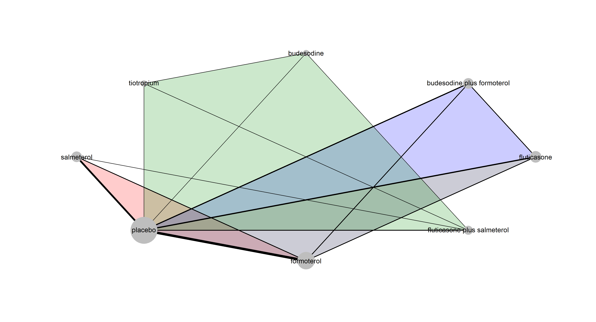
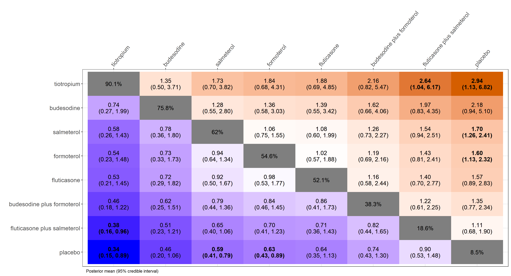
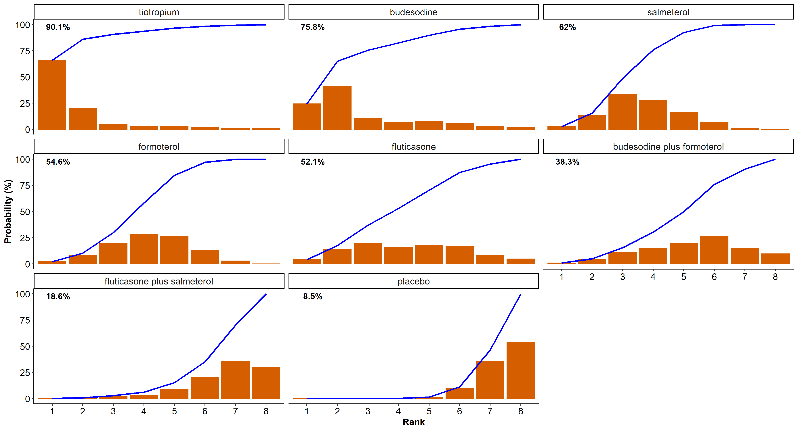

*** 

<!---# rnmamod: package to perform Bayesian network meta-analysis methods--->
# rnmamod: A Bayesian network meta-analysis package for R 


<!-- badges: start -->
[](https://github.com/LoukiaSpin/rnmamod/actions)
[](https://github.com/LoukiaSpin/rnmamod/actions)
<!-- badges: end -->
  

## Contributors

[Loukia Spineli](https://orcid.org/0000-0001-9515-582X), [Chrysostomos Kalyvas](https://orcid.org/0000-0003-0606-4518), [Katerina Papadimitropoulou](https://orcid.org/0000-0002-5732-4044)

## Description 

The `rnmamod` package performs one-stage fixed-effect or random-effects Bayesian network meta-analysis (NMA) while adjusting for *missing participant outcome data* using the pattern-mixture model. In the case of two interventions, the package performs one-stage Bayesian pairwise meta-analysis. 

The package handles data inputs in *arm-based format*:
- binary data (effect size: odds ratio)  
- continuous data (effect size: raw and standardised mean differences, ratio of means).

<!--- The pattern-mixture model allows the incorporation of the informative missingness odds ratio for binary outcomes, whilst the informative missingness difference of means and the informative missingness ratio of means for continuous outcomes. --->

The `rnmamod` package comprises a suite of all necessary models for estimation and prediction of the intervention effect, and evaluation of the consistency assumption locally and globally. Also includes a rich suite of visualisation tools to aid in interpretation of the results and preparation of NMA manuscript submission. 
Missing participant outcome data are addressed in all models of the package.

<!---that aid the interpretation and accommodation of the results in the submitted research work for publication. --->

The `rnmamod` package is currently in development version.

## Getting started

Run the following code to install the development version of the package:

    install.packages("devtools")
    devtools::install_github("LoukiaSpin/rnmamod")

## Example

<!--- We will use the dataset of --->
[Baker et al. (2009)](https://pubmed.ncbi.nlm.nih.gov/19637942/) comprising 21 trials comparing seven pharmacologic interventions with each other and placebo in chronic obstructive pulmonary disease (COPD) patients. The exacerbation of COPD (harmful outcome) is the analysed binary outcome.

``` r
head(nma.baker2009)
#>                 study t1 t2 t3 t4 r1 r2 r3 r4 m1 m2 m3 m4  n1  n2 n3 n4
#> Llewellyn-Jones, 1996  1  4 NA NA  3  0 NA NA  1  0 NA NA   8   8 NA NA
#>        Paggiaro, 1998  1  4 NA NA 51 45 NA NA 27 19 NA NA 139 142 NA NA
#>          Mahler, 1999  1  7 NA NA 47 28 NA NA 23  9 NA NA 143 135 NA NA
#>        Casaburi, 2000  1  8 NA NA 41 45 NA NA 18 12 NA NA 191 279 NA NA
#>       van Noord, 2000  1  7 NA NA 18 11 NA NA  8  7 NA NA  50  47 NA NA
#>         Rennard, 2001  1  7 NA NA 41 38 NA NA 29 22 NA NA 135 132 NA NA
```

### Network plot

Create the network plot using the *nma.networkplot* function of the [pcnetmeta](https://CRAN.R-project.org/package=netmeta) R package:

``` r
# The names of the interventions in the order they appear in the dataset
interv_names <- c("placebo", "budesonide", "budesonide plus formoterol", "fluticasone", "fluticasone plus salmeterol", "formoterol", "salmeterol", "tiotropium")

netplot(data = nma.baker2009, drug_names = interv_names, text.cex = 1.5)
```

<div style="text-align: center"> 

</div>

### Perform Bayesian random-effects network meta-analysis

The following code performs a Bayesian random-effects network meta-analysis under the *missing at random assumption* while using an intervention-specific informative missingness odds ratio (`assumption = "IDE-ARM"`) in the logarithmic scale:

``` r
res <- run_model(data = nma.baker2009,
                 measure = "OR",
                 model = "RE",
                 assumption = "IDE-ARM",
                 heter_prior = list("halfnormal", 0, 1),
                 mean_misspar = c(0, 0), 
                 var_misspar = 1,
                 D = 0,
                 n_chains = 3,
                 n_iter = 10000,
                 n_burnin = 1000,
                 n_thin = 1)
```

### League table

Illustrate all possible pairwise comparisons of the interventions using a league heatmap. Interventions are sorted in decreasing order by their posterior mean SUCRA (surface under the cumulative ranking) value in the main diagonal:

``` r
league_heatmap(full = res, drug_names = interv_names)
```

<div style="text-align: center"> 
  
<!---  --->  
<!---  --->
</div>
<br/>

### Rankogram with SUCRA curves

The following code presents the hierarchy of the interventions in the network using integrated rankograms and SUCRA curves:

``` r
rankosucra_plot(full = res, drug_names = interv_names)
```

<div style="text-align: center"> 
  
<!---  --->
<!---  --->
</div>

## Funding source

The development of `rnmamod` package is funded by the **German Research Foundation** (Deutsche Forschungsgemeinschaft) (grant no. [SP 1664/1-3](https://gepris.dfg.de/gepris/projekt/339420617)) <div style="text-align: right"> </div>
