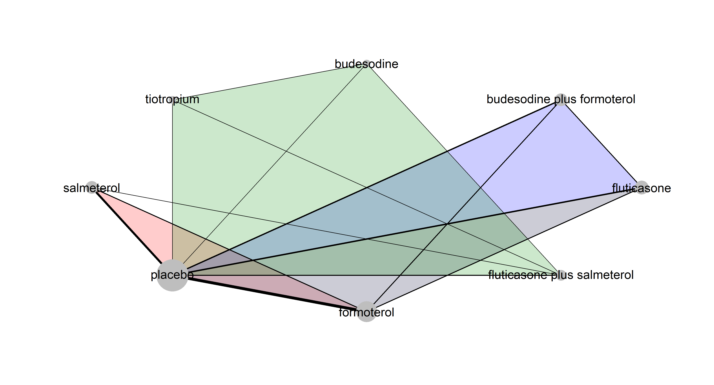
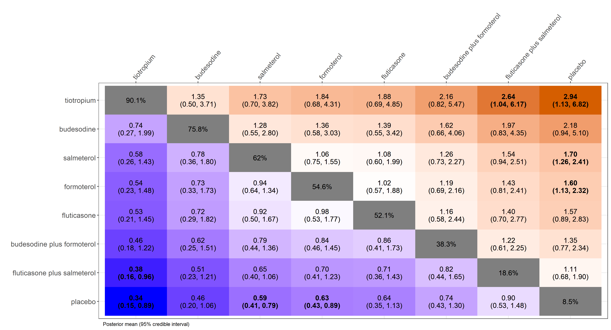

*** 

# rnmamod: package to perform Bayesian network meta-analysis methods

  <!-- badges: start -->
  [](https://github.com/LoukiaSpin/rnmamod/actions)
  <!-- badges: end -->

**rnmamod** is an R package to perform one-stage Bayesian fixed-effect or random-effects network meta-analysis while adjusting for *missing participant outcome data* using the pattern-mixture model. In the case of two inteventions, rnmamod performs one-stage Bayesian pairwise meta-analysis. The package handles a data-frame of binary or continuous outcome data in the arm-based format. The odds ratio, mean difference, standardised mean difference, and ratio of means are currently considered. The pattern-mixture model allows the incorporation of the informative missingness odds ratio for binary outcomes, whilst the informative missingness difference of means and the informative missingness ratio of means for continuous outcomes. The package comprises a suite of all necessary models for estimation and prediction of the intervention effect, and evaluation of the consistency assumption locally and globally. Missing participant outcome data are addressed in all models of the rnmamod package. The rnmamod package also includes a rich suite of visualisation tools that aid the interpretation and accommodation of the results in the submitted research work for publication. 

The rnmamod package is currently in development version.

## Installation

Run the following code to install rnmamod:

    devtools::install_github("LoukiaSpin/rnmamod")
    library(rnmamod)

## Example

We will use the dataset of [Baker et al. (2009)](https://pubmed.ncbi.nlm.nih.gov/19637942/) that includes 21 trials comparing seven pharmacologic interventions with each other and placebo in chronic obstructive pulmonary disease (COPD) patients. The prevention of COPD exacerbation (beneficial outcome) is the analysed binary outcome.

``` r
head(nma.baker2009)
#>                 study t1 t2 t3 t4  r1  r2 r3 r4 m1 m2 m3 m4  n1  n2 n3 n4
#> Llewellyn-Jones, 1996  1  3 NA NA   4   8 NA NA  1  0 NA NA   8   8 NA NA
#>        Paggiaro, 1998  1  3 NA NA  61  78 NA NA 27 19 NA NA 139 142 NA NA
#>          Mahler, 1999  1  6 NA NA  73  98 NA NA 23  9 NA NA 143 135 NA NA
#>        Casaburi, 2000  1  7 NA NA 132 222 NA NA 18 12 NA NA 191 279 NA NA
#>       van Noord, 2000  1  6 NA NA  24  29 NA NA  8  7 NA NA  50  47 NA NA
#>         Rennard, 2001  1  6 NA NA  65  72 NA NA 29 22 NA NA 135 132 NA NA
```

Create the network plot:

``` r
# The names of the interventions in the order they appear in the dataset
interv.names <- c("placebo", "budesodine", "budesodine plus formoterol", "fluticasone", "fluticasone plus salmeterol", "formoterol", "salmeterol", "tiotropium")

netplot(data = nma.baker2009, drug.names = interv.names, text.cex = 1.5)
```

<div style="text-align: center"> </div>

The following code performs a Bayesian random-effects network meta-analysis under the missing at random assumption and using intervention-specific informative missingness odds ratio (`assumption = "IDE-ARM"`) in the logarithmic scale:

``` r
res <- run.model(data = nma.baker2009,
                 measure = "OR",
                 model = "RE",
                 assumption = "IDE-ARM",
                 heter.prior = list("halfnormal", 0, 1),
                 mean.misspar = 0,
                 var.misspar = 1,
                 D = 1,
                 n.chains = 3,
                 n.iter = 10000,
                 n.burnin = 1000,
                 n.thin = 1)
```
<br/>
Illustrate all possible pairwise comparisons of the interventions using a league heatmap:

``` r
league.heatmap(full = res, drug.names = interv.names)
```

<div style="text-align: center"> </div>
<br/>
The following code presents the hierarchy of the interventions in the network using integrated rankograms and SUCRA (surfacw under the cumulative ranking) curves:

``` r
rankosucra.plot(full = res, drug.names = interv.names)
```

<div style="text-align: center"> </div>

##
The development of the **rnmamod** package is funded by the **German Research Foundation** (Deutsche Forschungsgemeinschaft) (grant no. [SP 1664/1-3](https://gepris.dfg.de/gepris/projekt/339420617)) <div style="text-align: right"> </div>
