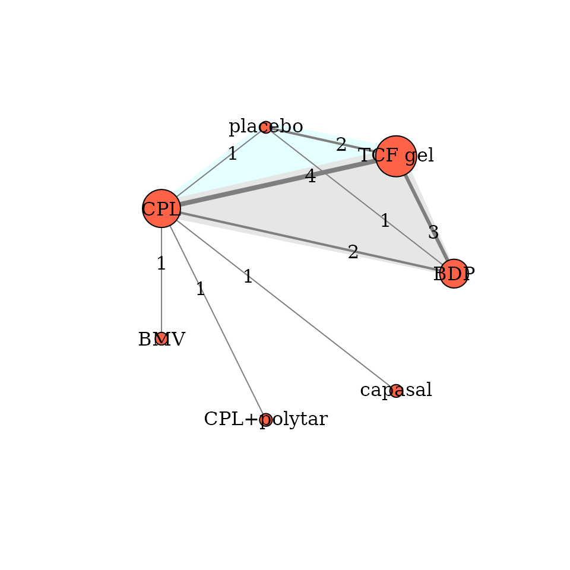
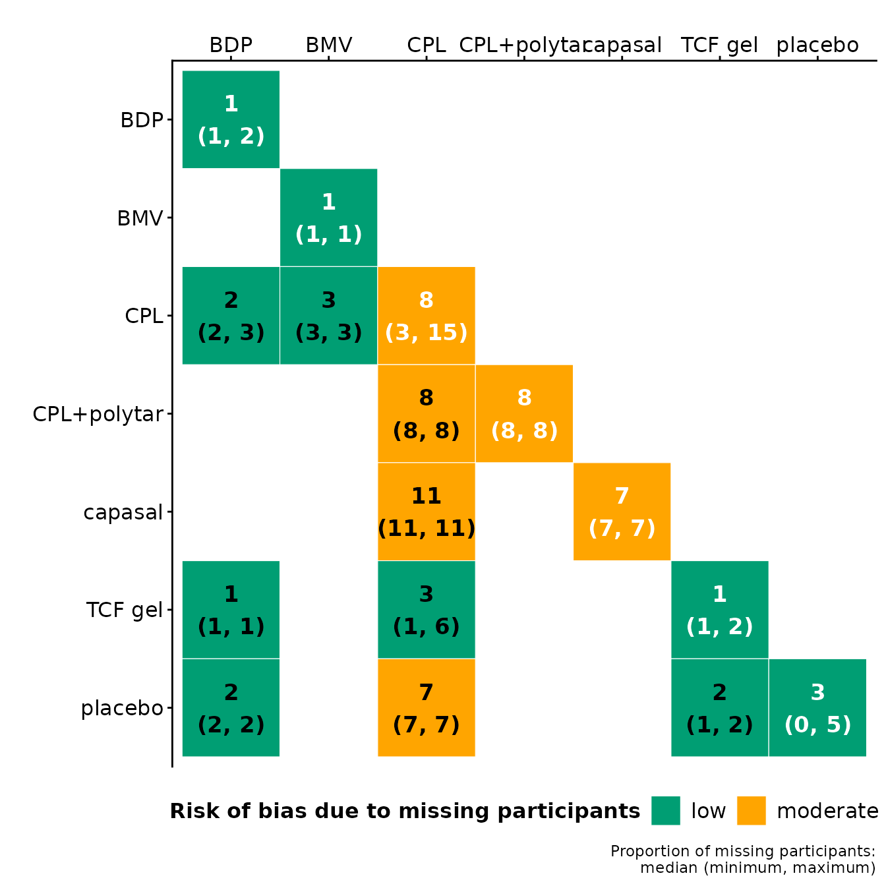
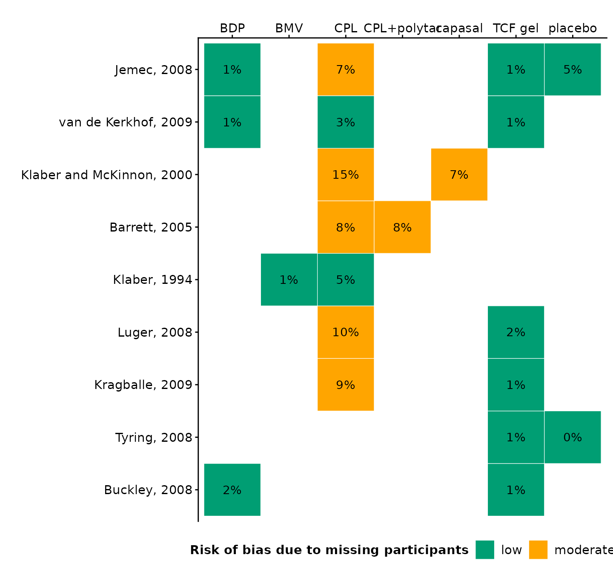

# Description of the network

## Introduction

This vignette aims to illustrate the toolkits of the **rnmamod** package
for the creation of the network plot and summarisation of the
corresponding outcome data. If missing participant outcome data (MOD)
have been extracted for all trials of the dataset, the **rnmamod**
package facilitates visualising the proportion of MOD across the network
and within the dataset.

## Example on a binary outcome

### Dataset preparation

We will use the systematic review of [Bottomley et al.,
(2011)](https://pubmed.ncbi.nlm.nih.gov/21142838/) that comprises 9
trials comparing six pharmacologic interventions with each other and
placebo for moderately severe scalp psoriasis. The analysed binary
outcome is the investigator global assessment response at 4 weeks
([`?nma.bottomley2011`](https://loukiaspin.github.io/rnmamod/reference/nma.bottomley2011.md)).

                          study t1 t2 t3 t4  r1  r2  r3 r4 m1 m2 m3 m4  n1  n2  n3  n4
    1             Buckley, 2008  1  6 NA NA  67  79  NA NA  2  1 NA NA 110 108  NA  NA
    2              Tyring, 2008  6  7 NA NA  74  12  NA NA  2  0 NA NA 135  42  NA  NA
    3           Kragballe, 2009  3  6 NA NA  19 114  NA NA  9  2 NA NA 105 207  NA  NA
    4               Luger, 2008  3  6 NA NA 101 196  NA NA 44  9 NA NA 431 419  NA  NA
    5              Klaber, 1994  2  3 NA NA 175 138  NA NA  2 11 NA NA 234 240  NA  NA
    6             Barrett, 2005  3  4 NA NA  79  79  NA NA 19 18 NA NA 225 236  NA  NA
    7 Klaber and McKinnon, 2000  3  5 NA NA  55  31  NA NA 35 16 NA NA 238 237  NA  NA
    8      van de Kerkhof, 2009  1  3  6 NA 287  74 311 NA  7  8  4 NA 563 286 568  NA
    9               Jemec, 2008  1  3  6  7 304  64 362 20  6 20  8  7 556 272 541 136

The dataset has the one-trial-per-row format containing arm-level data
for each trial. This format is widely used for BUGS models. For a binary
outcome, the dataset must have a minimum of three items:

- item `t` that refers to the intervention identifier for the
  corresponding (intervention) arm;
- item `r` that refers to the number of observed events in the
  corresponding arm.
- item `n` that refers to the number of randomised participants in the
  corresponding arm.

If there is at least one trial that reports the number of missing
participants per arm, we also include the item `m` in the dataset. If a
trial reports the *total* number of missing participants rather than the
number of missing participants per arm, we indicate with `NA` in the
item `m` the arms of the corresponding trial.

In the example, the maximum number of interventions observed in a trial
is four. Therefore, each element comprises four columns (e.g., `t1`,
`t2`, `t3`, `t4`) to indicate the maximum number of arms in the dataset.
Furthermore, all trials of the dataset reported the number of missing
participants per arm; therefore, the element `m` appears in the dataset.

### The network plot

The function `netplot` (see ?netplot for help) creates the network plot
using only two arguments: the `data` for the dataset (in
one-trial-per-row format) and `drug_names` for the names of each
intervention in the dataset.

``` r

netplot(data = nma.bottomley2011, drug_names = c("BDP", "BMV", "CPL", "CPL+polytar", "capasal", "TCF gel", "placebo"), show_multi = TRUE, edge_label_cex = 1)
```



The intervention names in `drug_names` must be sorted in the ascending
order of their identifier. Hence, `1` in the element `t` refers to
`BDP`, (betamethasone dipropionate) `2` to `BMV` (betamethasone
valerate), `3` to `CPL` (calcipotriol) and so on. See Details in
`?nma.bottomley20119` for the names of the interventions.

Each node refers to an intervention and each edge refers to a pairwise
comparison. The size of a node and the thickness of an edge are weighted
by the number of trials that investigated the corresponding intervention
and pairwise comparison, respectively.

### Network characteristics

`netplot` also produces a table with the characteristics of the network,
such as the number of interventions, number of possible comparisons,
number of direct comparisons (i.e., comparisons of interventions
informed by at least one trial), and so on:

| Characteristic                      | Total |
|:------------------------------------|:------|
| Interventions                       | 7     |
| Possible comparisons                | 21    |
| Direct comparisons                  | 9     |
| Indirect comparisons                | 12    |
| Trials                              | 9     |
| Two-arm trials                      | 7     |
| Multi-arm trials                    | 2     |
| Randomised participants             | 5889  |
| Proportion of completers            | 96    |
| Proportion of observed events       | 47    |
| Trials with at least one zero event | 0     |
| Trials with all zero events         | 0     |

Description of the network {.table}

### Distribution of the outcome

Furthermore, `netplot` returns a table that summarises the number of
trials, number of randomised participants and the proportion of
completers (participants who completed the trial) **per intervention**.
In the case of a binary outcome, the table additionally illustrates the
distribution of the outcome as proportion across the corresponding
trials:

| Interventions | Total trials | Total randomised | Completers (%) | Total events (%) | Min. events (%) | Median events (%) | Max. events (%) |
|:---|:--:|:--:|:--:|:--:|:--:|:--:|:--:|
| BDP | 3 | 1229 | 99 | 54 | 52 | 55 | 62 |
| BMV | 1 | 234 | 99 | 75 | 75 | 75 | 75 |
| CPL | 7 | 1797 | 92 | 32 | 20 | 27 | 60 |
| CPL+polytar | 1 | 236 | 92 | 36 | 36 | 36 | 36 |
| capasal | 1 | 237 | 93 | 14 | 14 | 14 | 14 |
| TCF gel | 6 | 1978 | 99 | 58 | 48 | 56 | 74 |
| placebo | 2 | 178 | 96 | 19 | 16 | 22 | 29 |

Interventions {.table}

An identical table is returned for the **observed comparisons** in the
network:

| Comparisons | Total trials | Total randomised | Completers (%) | Total events (%) | Min. events (%) | Median events (%) | Max. events (%) |
|:---|:--:|:--:|:--:|:--:|:--:|:--:|:--:|
| capasal vs CPL | 1 | 475 | 89 | 20 | 20 | 20 | 20 |
| CPL vs BDP | 2 | 1677 | 98 | 45 | 43 | 45 | 46 |
| CPL vs BMV | 1 | 474 | 97 | 68 | 68 | 68 | 68 |
| CPL+polytar vs CPL | 1 | 461 | 92 | 37 | 37 | 37 | 37 |
| placebo vs BDP | 1 | 692 | 98 | 48 | 48 | 48 | 48 |
| placebo vs CPL | 1 | 408 | 93 | 22 | 22 | 22 | 22 |
| placebo vs TCF gel | 2 | 854 | 98 | 56 | 49 | 53 | 58 |
| TCF gel vs BDP | 3 | 2446 | 99 | 58 | 53 | 61 | 68 |
| TCF gel vs CPL | 4 | 2829 | 96 | 46 | 37 | 45 | 54 |

Observed comparisons {.table style="width:100%;"}

The users can export all tables in xlsx file at the working directory of
their project by adding the argument `save_xls = TRUE` in the
`describe_network` function.

### Distribution of missing participants across the network

When missing participants have been reported for *each arm of every*
trial, we use the `heatmap_missing_network` function to illustrate the
distribution of the proportion of missing participants **per
intervention** (main diagonal) and **observed comparison** (lower
off-diagonal) in the network (see Details in
[`?heatmap_missing_network`](https://loukiaspin.github.io/rnmamod/reference/heatmap_missing_network.md)).

``` r

heatmap_missing_network(data = nma.bottomley2011, drug_names = c("BDP", "BMV", "CPL", "CPL+polytar", "capasal", "TCF gel", "placebo"))
```



The **green** colour implies a median proportion of missing participant
up to 5%, and hence, a **low risk** associated with the missing
participants. The **red** colour implies a median proportion of missing
participant over 20%, and hence, a **high risk** associated with the
missing participants; otherwise, **orange** indicates a **moderate
risk**.

In the example, most of the interventions and observed comparisons were
associated with a *low* risk due the participant losses.

### Distribution of missing participants across the trials

Use the `heatmap_missing_dataset` function To illustrate the proportion
of missing participants in each arm of every trial in the dataset :

``` r

heatmap_missing_dataset(data = nma.bottomley2011, trial_names = nma.bottomley2011$study, drug_names = c("BDP", "BMV", "CPL", "CPL+polytar", "capasal", "TCF gel", "placebo"))
```



## References

Bottomley JM, Taylor RS, Ryttov J. The effectiveness of two-compound
formulation calcipotriol and betamethasone dipropionate gel in the
treatment of moderately severe scalp psoriasis: a systematic review of
direct and indirect evidence. *Curr Med Res Opin*
2011;**27**(1):251–268. [doi:
10.1185/03007995.2010.541022](https://pubmed.ncbi.nlm.nih.gov/21142838/)
