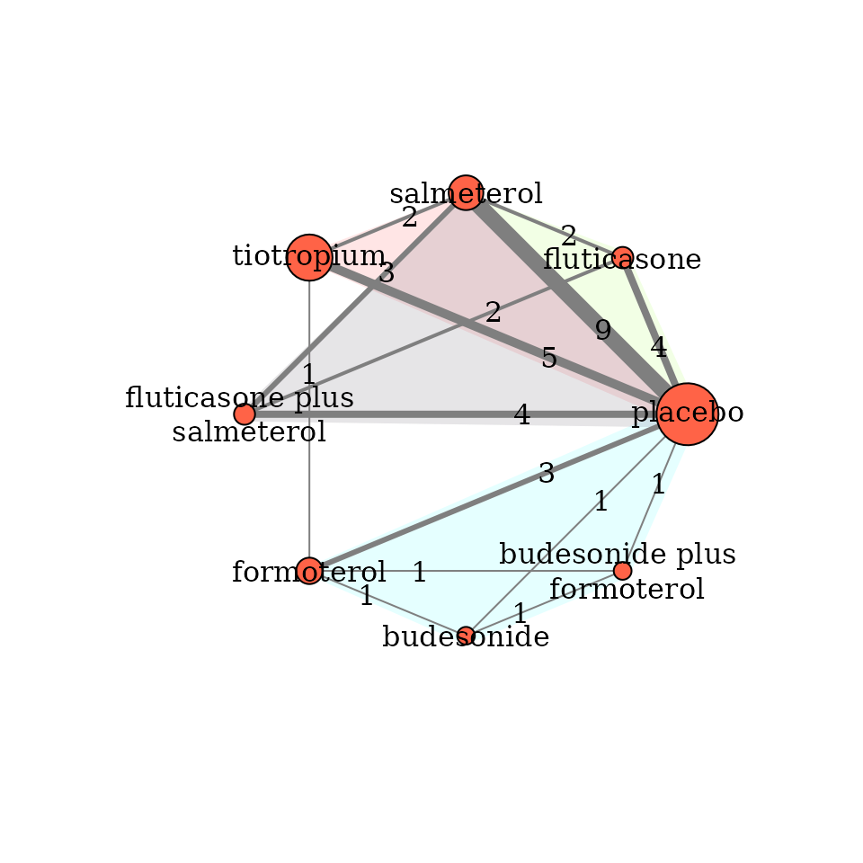

# Perform network meta-analysis

## Introduction

This vignette illustrates how to perform a one-stage Bayesian
random-effects network meta-analysis with consistency equation using the
`run_model` function. This function includes arguments to handle
aggregate missing participant outcome data (MOD) in each arm of every
trial via the pattern-mixture model.

## Example on a binary outcome

We will use the network on pharmacologic interventions for chronic
obstructive pulmonary disease (COPD) from the systematic review of
[Baker et al. (2009)](https://pubmed.ncbi.nlm.nih.gov/19637942/). This
network comprises 21 trials comparing seven pharmacological
interventions with each other and placebo. The exacerbation of COPD
(harmful outcome) is the analysed binary outcome (see
[`?nma.baker2009`](https://loukiaspin.github.io/rnmamod/reference/nma.baker2009.md)).



## Perform Bayesian random-effects network meta-analysis

### Run the model

`run_model` calls the `jags` function from the
[**R2jags**](https://CRAN.R-project.org/package=R2jags) package to
perform the Bayesian analysis using the BUGS code of Dias and colleagues
(2013).

``` r
run_model(data = nma.baker2009,
          measure = "OR",
          heter_prior = list("halfnormal", 0, 1),
          D = 0,
          n_chains = 3,
          n_iter = 10000,
          n_burnin = 1000,
          n_thin = 1)
```

With only the minimum required arguments, the function adjusts MOD under
the missing-at-random assumption (MAR; by default) via the informative
missingness odds ratio (IMOR) in the logarithmic scale (White et
al. (2008)): The minimum required arguments of `run_model` include
specifying:

- the dataset (a data-frame with one-trial-per-row format) in `data`
  (see
  [`?data_preparation`](https://loukiaspin.github.io/rnmamod/reference/data_preparation.md));
- the effect measure in `measure` (see ‘Arguments’ in
  [`?run_model`](https://loukiaspin.github.io/rnmamod/reference/run_model.md)):
- the prior distribution for the heterogeneity parameter in
  `heter_prior` (see
  [`?heterogeneity_param_prior`](https://loukiaspin.github.io/rnmamod/reference/heterogeneity_param_prior.md));
- the direction of the outcome in `D` (here, `D = 0` because the outcome
  is harmful; see, ‘Arguments’ in
  [`?run_model`](https://loukiaspin.github.io/rnmamod/reference/run_model.md))
- the number of chains in `n_chains` (see ‘Arguments’ in
  [`?run_model`](https://loukiaspin.github.io/rnmamod/reference/run_model.md)
  – also for the subsequent arguments);
- the number of iterations in `n_iter`;
- the number of burn-in in `n_burnin`, and
- the thinning in `n_thin`.

### Using all arguments

Suppose we decide to use an *empirically-based prior distribution for
the between-trial variance* that aligns with the outcome and
interventions under investigation. We also consider a *hierarchical
structure for the prior normal distribution of the log IMOR that is
specific to the interventions* in the network (`assumption = "HIE-ARM"`)
(Turner et al., 2015a; Spineli, 2019). We still assume MAR on average
with variance of log IMOR equal to 1 (`var_misspar = 1`) which is also
the default argument. In this case, `run_model` must be specified as
follows:

``` r
run_model(data = nma.baker2009,
          measure = "OR",
          model = "RE",
          assumption = "HIE-ARM",
          heter_prior = list("lognormal", -2.06, 0.438),
          mean_misspar = c(0, 0),
          var_misspar = 1,
          D = 0,
          n_chains = 3,
          n_iter = 10000,
          n_burnin = 1000,
          n_thin = 1)
```

The argument `model = "RE"` refers to the random-effects model. For the
fixed-effect model, use `model = "FE"`.

`heter_prior = list("lognormal", -2.06, 0.438)` refers to ‘symptoms
reflecting the continuation of condition’ for the ‘pharmacological
versus placebo’ comparison-type as elicited by Turner and colleagues
(2015b).

In the argument `mean_misspar = c(0, 0)`, the first and second element
of the vector refers to the mean log IMOR in the non-reference
interventions and the reference intervention of the network,
respectively – the latter is always the intervention with identifier
equal to 1. Hence, for all non-reference interventions we can consider
**the same** mean log IMOR. See ‘Details’ in
[`?missingness_param_prior`](https://loukiaspin.github.io/rnmamod/reference/missingness_param_prior.md)

### The output

`run_model` returns **a list of R2jags output** on the summaries of the
posterior distribution, and the Gelman-Rubin convergence diagnostic of
the monitored parameters (see ‘Value’ in
[`?run_model`](https://loukiaspin.github.io/rnmamod/reference/run_model.md)).
The output is used as an S3 object by other functions of the package to
be processed further and provide an end-user-ready output. See, for
example, the function
[`?league_heatmap`](https://loukiaspin.github.io/rnmamod/reference/league_heatmap.md)
that creates the league table with the effect sizes of all possible
comparisons in the network.

### No or partially extracted missing participant outcome data

`run_model` can also handle a dataset where MOD have not be extracted or
MOD have been extracted for some trials or trial-arms. For illustrative
purposes, we removed the item `m` from `nma.baker2009` to indicate that
MOD were not extracted for this outcome:

                      study t1 t2 t3 t4 r1 r2 r3 r4  n1  n2 n3 n4
    1 Llewellyn-Jones, 1996  1  4 NA NA  3  0 NA NA   8   8 NA NA
    2        Paggiaro, 1998  1  4 NA NA 51 45 NA NA 139 142 NA NA
    3          Mahler, 1999  1  7 NA NA 47 28 NA NA 143 135 NA NA
    4        Casaburi, 2000  1  8 NA NA 41 45 NA NA 191 279 NA NA
    5       van Noord, 2000  1  7 NA NA 18 11 NA NA  50  47 NA NA
    6         Rennard, 2001  1  7 NA NA 41 38 NA NA 135 132 NA NA

Using the minimum required arguments, `run_model` will run and provide
results.

`run_model` calls the `data_preparation` function. The latter creates a
pseudo-data-frame for the item `m` (see ‘Value’ in
[`?data_preparation`](https://loukiaspin.github.io/rnmamod/reference/data_preparation.md))
that assigns `NA` to all trial-arms. `data_preparation` also creates the
pseudo-data-frame `I` that has the same dimension with the other items
in the dataset, and assigns the zero value to all trial-arms to indicate
that no MOD have been extracted. Both pseudo-data-frames aim to retain
in the dataset the trials without information on MOD; otherwise, these
trials would have been excluded from the analysis. See ‘Details’ in
[`?data_preparation`](https://loukiaspin.github.io/rnmamod/reference/data_preparation.md)
and
[`?run_model`](https://loukiaspin.github.io/rnmamod/reference/run_model.md).

## References

Dias S, Sutton AJ, Ades AE, Welton NJ. Evidence synthesis for decision
making 2: a generalized linear modeling framework for pairwise and
network meta-analysis of randomized controlled trials. *Med Decis
Making* 2013;**33**(5):607–617. [doi:
10.1177/0272989X12458724](https://pubmed.ncbi.nlm.nih.gov/23104435/)

White IR, Higgins JP, Wood AM. Allowing for uncertainty due to missing
data in meta-analysis–part 1: two-stage methods. *Stat Med*
2008;**27**(5):711–27. [doi:
10.1002/sim.3008](https://pubmed.ncbi.nlm.nih.gov/17703496/)

Turner NL, Dias S, Ades AE, Welton NJ. A Bayesian framework to account
for uncertainty due to missing binary outcome data in pairwise
meta-analysis. *Stat Med* 2015a;**34**(12):2062–80. [doi:
10.1002/sim.6475](https://pubmed.ncbi.nlm.nih.gov/25809313/)

Spineli LM. An empirical comparison of Bayesian modelling strategies for
missing binary outcome data in network meta- analysis. *BMC Med Res
Methodol* 2019;**19**(1):86. [doi:
10.1186/s12874-019-0731-y](https://pubmed.ncbi.nlm.nih.gov/31018836/)

Turner RM, Jackson D, Wei Y, Thompson SG, Higgins JPT. Predictive
distributions for between-study heterogeneity and simple methods for
their application in Bayesian meta-analysis. *Stat Med*
2015b;**34**(6):984–98. [doi:
10.1002/sim.6381](https://pubmed.ncbi.nlm.nih.gov/25475839/)
